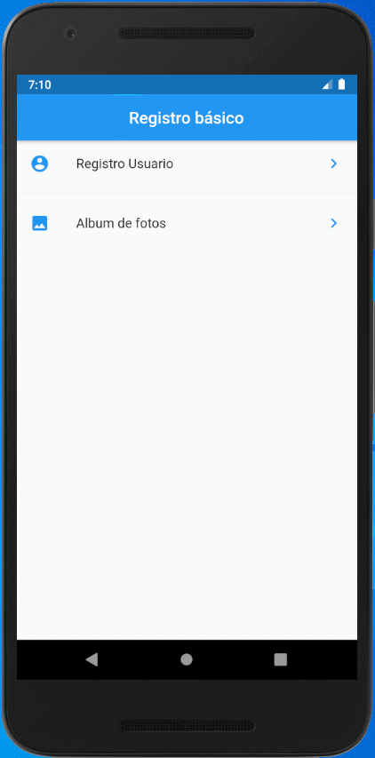

# Proyecto

<table border="0">
    <tr>
        <td></td>
        <td>Es un pequeño ejercicio usando los componentes básicos del framework Flutter</td>
    </tr>
</table>

## Observaciones

Las herramientas que se usan en un inicio fueron diseñadas tomando en cuenta el curso de Flutter tomado en Udemy.

## Resultados

